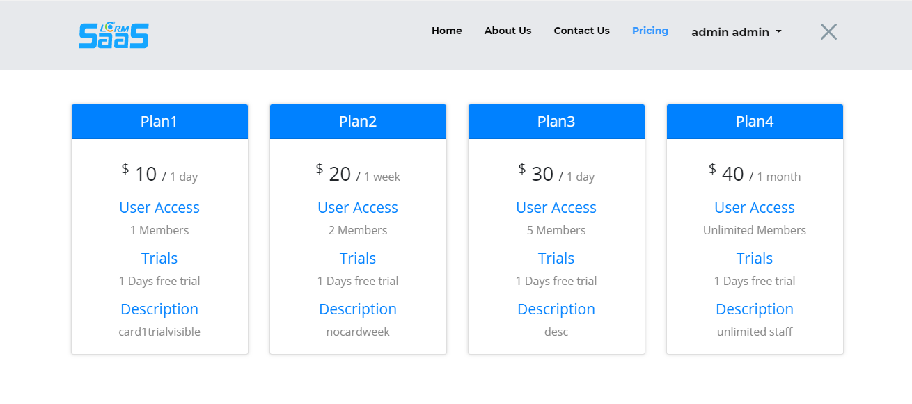

# Frontend

Frontend consists of

1. Home
2. About Us 
3. Contact Us 
4. Pricing
5. Privacy Policy
6. Signup
7. Login

Note: After editing any blade.php file be sure to run `php artisan view:clear`

**1.** **Home page**

To change the content, edit `resources/views/frontend/index.blade.php`

To change the header \(nav bar\) , edit `resources/views/frontend/_header_custom.blade.php`

**2. About Us**

To change the content, edit `resources/views/frontend/about_us.blade.php`

To change the header \(nav bar\) , edit `resources/views/frontend/_header_custom.blade.php`

**3. Contact Us**

To change the content, edit `resources/views/frontend/contactus.blade.php`

To change the header \(nav bar\) , edit `resources/views/frontend/_header_custom.blade.php`

**4. Pricing**

To change the content, edit `resources/views/frontend/pricing.blade.php`

To change the header \(nav bar\) , edit `resources/views/frontend/_header.blade.php`

|  |
| :--- |

**5.Privacy Policy**

To change the content, edit `resources/views/frontend/privacy.blade.php`

To change the header \(nav bar\) , edit `resources/views/frontend/_header.blade.php`

**6. SignUp**

To change the content, edit `resources/views/frontend/register.blade.php`

To change the header \(nav bar\) , edit `resources/views/frontend/_header.blade.php`

**7. Login**

To change the content, edit `resources/views/login.blade.php`

To change the header \(nav bar\) , edit `resources/views/frontend/_header.blade.php`

