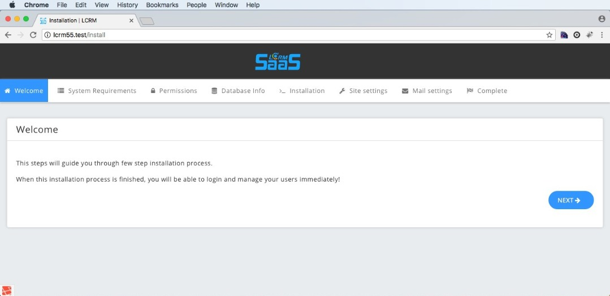

# Installation

Installing the lcrmsaas can be done in two ways. They are

1. Web Installation
2. Manual Installation

**1.Web Installation:** 

To begin Installation copy the files to your server.

* Open the URL in the browser.
* Then fill the mandatory fields during the installation \(check all the tabs\)



**Note:** 

* If you are using localhost open the root as "localhost/lcrm\_saas/public" then it automatically redirects to install page.
* If you are hosting from the root of the server or using a virtualhost, then open the root as "servername/public". If you want to get rid of "/public", please follow these tutorials. [http://blog.netgloo.com/2016/01/29/deploy-laravel-application-on-shared-hosting/](http://blog.netgloo.com/2016/01/29/deploy-laravel-application-on-shared-hosting/)

**2. Manual Installation :**

If you prefer to install and configure the product manually, you can follow the below steps.

* Edit the `.env` file to fill the appropriate details like app url, database details.
* Remove the `VerifyInstallation`middleware from `app/Http/Kernel.php`file.
* Remove the `require 'install.php';` line from `routes/web.php`file.
* Edit the `SettingsSeeder.php` and `ManualInstall.php`in the `database/seeds/` directory and fill appropriate details.
* Give the necessary permissions for the `storage` and `bootstrap/cache`directories.
* ```text
  chmod -R 775 storage
  chmod -R 775 bootstrap/cache
  chmod -R 775 public
  chmod -R 775 .env
  ```

  If you are on linux/ mac you can run below command to chown it.

  ```text
  chown -R www-data /var/www
  ```

* Run the following commands:
* `php artisan key:generate`
* `php artisan migrate --seed`
* `php artisan db:seed --class=ManualInstall`

## compile assets <a id="compile-assets"></a>

> If you don't have good knowledge on nodejs and npm, you can copy public folder files from codecanyon's downloaded files

Make sure you have [nodejs](https://nodejs.org/) installed in your system with minimum version`6.14.1`,

you can check installed version by running`node -v`command in terminal.

**install local packages**

`yarn`

**move assets to public**

`npm run dev`

Then open the site and check if everything is working by logging in using the details provided.

**Note:**

* If you are familiar with Laravel consider setting a [queue](https://laravel.com/docs/5.5/queues#introduction) driver and run a [queue:work process](https://laravel.com/docs/5.5/queues#running-the-queue-worker) in order to make time taking tasks like sending a mail run separately and make the request faster.
* Make sure that you should use **Virtual Host** instead of **Localhost** because we are using **vat calculator** Which supports only virtual host.

